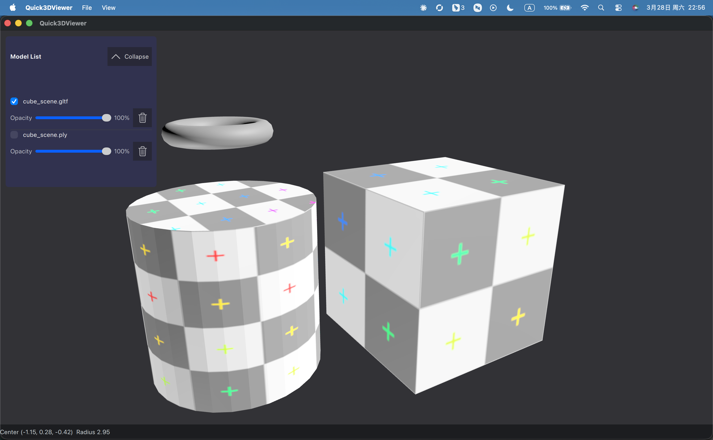

# Quick3DViewer

基于 Qt Quick 3D 的跨平台模型浏览器

Quick3DViewer is a cross-platform model viewer built with Qt Quick 3D.

<p align=center>
    
</p>

## 功能 Features

- 拖拽、文件对话框或直接选择文件夹批量导入 PLY / STL / OBJ / glTF / glb 模型，支持多模型同时显示与列表管理。

- Drag-and-drop, file dialogs, or full-folder import for PLY / STL / OBJ / glTF / glb files with simultaneous multi-model display and list management.

## 构建 Build

```bash
cmake -S . -B build -DCMAKE_BUILD_TYPE=Release
cmake --build build
```